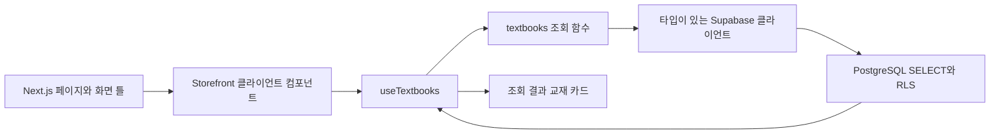

# AuraWorks Assignment — HIDDEN KICE

제공된 히든카이스 스토어 화면을 Next.js App Router로 구현한 과제입니다. 교재 정보는 Supabase PostgreSQL에 저장하고, 브라우저에서 조회해 표시합니다.

- 배포 사이트: [auraworks-assignment-seven.vercel.app](https://auraworks-assignment-seven.vercel.app)
- GitHub: [torisKR/auraworks_assignment](https://github.com/torisKR/auraworks_assignment) · Public
- Supabase: 과제 전용 `auraworks_assignment` 프로젝트

## 기술 스택

| 영역       | 기술                                 | 선택 이유                                   |
| ---------- | ------------------------------------ | ------------------------------------------- |
| 프레임워크 | Next.js 16.3.4 · App Router          | 페이지 구성, 이미지 최적화, Vercel 배포     |
| UI         | React 19.2.4 · TypeScript 5.9.3      | 컴포넌트 재사용과 데이터·상태 계약의 명확성 |
| 스타일     | CSS · Pretendard                     | 제공 화면의 간격·색상·반응형 구현           |
| 데이터     | Supabase JS 2.110.1 · PostgreSQL     | 브라우저 조회와 RLS 접근 제어               |
| 품질 관리  | ESLint · TypeScript · Node.js 테스트 | 정적 검사와 핵심 로직 검증                  |
| 배포       | GitHub Actions · Vercel              | main 변경 시 검사와 자동 배포               |

의존성 버전과 lockfile을 저장합니다. pnpm 11에서 설치 스크립트가 필요한 `unrs-resolver@1.12.2`는 `pnpm-workspace.yaml`에 해당 버전만 허용했습니다.

## 구현 범위

- 원본 배너·단품·패스 에셋을 활용한 헤더, 배너, 4열 교재 목록, 푸터
- 데스크톱 4열, 태블릿 3열, 모바일 2열 반응형 레이아웃
- 400ms 스로틀을 적용한 Supabase 제목·과목 검색과 전체 / 패스 / 단품 필터
- Supabase에서 CSR로 교재 12개 조회
- 로딩 스켈레톤, 빈 목록, 검색 결과 없음, 조회 실패 및 재시도
- 교재 상세와 `/cart`: 중복 담기 수량 합산, 1~99권 변경, 전체·개별 선택과 삭제, 할인·합계, 새로고침 복원
- 5개 슬라이드 캐러셀, 게스트 입장·로그아웃, OMR 연습 채점, 챌린지 참여, 알림 읽음 처리
- 스토어·브랜드 소개·회사소개·약관·개인정보 안내의 독립 페이지
- 키보드 포커스, 검색 레이블, 필터 상태, `dialog`, reduced-motion 지원

사이트 화면·메타데이터·FAQ는 히든카이스 제품 문구를 사용합니다. 로그인 화면은 이메일·비밀번호 입력 없이 게스트로 입장하며, Supabase Auth 회원 로그인은 준비 중입니다. OMR은 연습 5문항 답안 비교, 챌린지는 메모리 상태 참여입니다. 교재 기본 데이터는 Supabase seed이고 상세 목차·가이드는 표시용 콘텐츠입니다. 주문·결제·답안 사진 분석은 준비 중으로 표시합니다. 게스트 학습 상태는 새로고침하면 초기화됩니다. 장바구니는 교재 ID·수량·선택 상태만 로컬 저장소에 유지하고 Supabase에서 교재와 현재 가격을 다시 조회합니다. 알림 읽음 ID도 로컬 저장소에 유지합니다.

첫 캐러셀 슬라이드는 원본 배너를 사용합니다. 추가 4개는 제공 교재 이미지와 HTML 문구로 구성했습니다. 이전·다음·선택 점·키보드 이동과 재생/정지를 제공합니다. 기본 정지 상태이며 자동 재생을 시작하면 6초 간격으로 이동합니다. 모바일에서는 원본 배너의 일부 영역이 잘립니다. 페이지별 경로와 체험 방법은 [추가 페이지 안내](docs/implemented-pages.md)에 정리했습니다.

## 실행

Node.js 22 이상과 pnpm 11.6.0을 사용합니다.

```bash
git clone https://github.com/torisKR/auraworks_assignment.git
cd auraworks_assignment
corepack enable
pnpm install --frozen-lockfile
cp .env.example .env.local
```

`.env.local`에 아래 두 값을 설정합니다. 키 값은 저장소에 올리지 않습니다.

```dotenv
NEXT_PUBLIC_SUPABASE_URL=https://your-project.supabase.co
NEXT_PUBLIC_SUPABASE_PUBLISHABLE_KEY=your-publishable-key
```

```bash
pnpm dev
# http://localhost:3000
```

설정이 없거나 조회에 실패하면 오류와 재시도 UI가 표시됩니다. 실제 Supabase 조회 대신 로컬 배열을 보여 주는 fallback은 없습니다.

## CSR 데이터 흐름



페이지와 화면 틀은 Next.js가 만들고, 교재는 브라우저의 `useEffect`에서 조회합니다. 조회 함수는 필요한 컬럼만 선택하고 `display_order`로 정렬합니다. 훅은 로딩·성공·실패 상태, 재시도와 언마운트 시 요청 취소를 담당합니다. 화면 컴포넌트는 SQL이나 클라이언트 초기화를 알 필요가 없습니다.

초기 진입 시 교재 12개를 조회합니다. 검색 입력은 400ms 스로틀을 거쳐 제목·과목의 서버 검색 조건에 반영하고 종류 필터도 Supabase에서 적용합니다. 이전 요청은 취소하며 마지막 입력값이 누락되지 않도록 처리했습니다. 더 큰 데이터에서는 조회 계층에 페이지네이션을 추가할 수 있습니다.

## 데이터베이스 재현

새 Supabase 프로젝트의 SQL Editor에서 순서대로 실행합니다.

1. `supabase/migrations/20261008023540_create_textbooks.sql`
2. `supabase/seed.sql`
3. `supabase/verify.sql`

검증 기대값은 교재 `12`, 단품 `3`, 패스 `9`, RLS `true`, 익명 SELECT `true`, INSERT/UPDATE/DELETE `false`입니다. seed는 같은 ID의 더미 교재를 갱신하므로 반복 실행할 수 있습니다. 스키마 migration은 새 프로젝트에서 한 번 적용합니다.

현재 과제용 원격 프로젝트에 스키마와 seed를 적용했습니다. SQL Editor에서 `anon` 역할로 12개 조회와 쓰기 권한 차단을 확인했습니다. 배포 페이지의 DevTools Network에서도 `/rest/v1/textbooks` 요청의 HTTP 200과 교재 12개 표시를 확인했습니다.

| 데이터                                        | 역할                      |
| --------------------------------------------- | ------------------------- |
| `id`                                          | UUID 식별자               |
| `title`, `subject`, `description`             | 교재 표시와 검색          |
| `category`                                    | `single` / `pass` 필터    |
| `image_path`                                  | 제공 이미지 경로          |
| `price`, `original_price`, `discount_percent` | 판매가, 정가, 배지 표시   |
| `display_order`                               | 화면의 안정적인 표시 순서 |

테이블에 RLS를 활성화하고 `anon`과 `authenticated`에 SELECT만 허용했습니다. 공개 키는 브라우저에 포함되지만 테이블 쓰기 권한은 없습니다. secret/service-role 키는 사용하지 않습니다. 새 사용자별 데이터나 주문 테이블을 추가하면 별도의 인증과 정책이 필요합니다.

제공 화면에는 정가 76,000원, 판매가 64,800원, 5% 배지가 함께 표시되어 있습니다. 화면 재현을 위해 이 값을 그대로 저장했습니다. 실제 할인율 계산을 적용하려면 할인 정책과 표시값을 먼저 일치시켜야 합니다.

## 구조

```text
src/
  app/                  # 스토어·상세·메뉴 경로, 메타데이터, 전역 스타일
  components/layout/    # 공통 화면과 게스트·장바구니 상태
  components/store/     # 캐러셀·목록·카드 UI
  features/             # 장바구니·상세·게스트 입장·OMR·챌린지·알림
  data/                 # 슬라이드·소개·목차·학습 가이드·알림 데이터
  hooks/                # 조회 상태·요청 취소·재시도·검색 스로틀
  lib/
    supabase.ts         # typed browser client
    textbooks.ts        # SELECT 쿼리
    catalog.ts          # 가격 표시와 카테고리 타입
    catalog-query.ts    # 서버 검색 조건
    throttle.ts         # 마지막 입력을 보장하는 스로틀
    cart.ts             # 저장 데이터 복구·수량 합산·선택 금액 계산
    *.test.ts           # 가격·검색·스로틀 검증
  types/database.ts     # 교재·데이터베이스 계약
  types/cart.ts         # 브라우저 저장 항목·현재 교재 결합 계약
public/images/          # 원본 제공 이미지
supabase/               # migration, seed, 권한 검증 SQL
scripts/                # 원격 조회 검증
docs/                   # 설계·면접·배포 설명
```

자세한 설명은 [설계 문서](docs/architecture.md), [면접 준비](docs/interview.md), [배포 안내](docs/deployment.md)를 참고하세요.

향후 구현 순서와 완료 기준은 [기능 확장 계획](docs/future-extension.md), 기능별 폴더 전환과 파일 이동은 [폴더 구조 확장 설계](docs/folder-evolution.md)에 정리했습니다. 전체 문서는 [문서 안내](docs/README.md)에서 확인할 수 있습니다.

UI, 비동기 상태, 데이터 접근, 데이터 타입을 역할별로 분리했습니다. 여러 경로가 생겨 공통 로그인·장바구니 상태는 `SiteShell`의 Context로 옮기고 검색·필터는 스토어에 유지했습니다. 장바구니·상세·게스트 입장·OMR·챌린지·알림은 `features/`에 모았습니다. 실제 인증·주문을 추가할 때는 서버 검증과 사용자별 RLS를 별도로 설계합니다.

## Vercel 배포

GitHub 저장소를 Vercel의 `auraworks-assignment` 프로젝트에 연결했습니다. 저장소 루트의 Next.js 앱을 빌드하고, `main` 커밋으로 Production 배포를 자동 생성합니다. 위 환경변수 두 개를 Preview와 Production에 설정합니다. `NEXT_PUBLIC_*` 값은 빌드에 포함되므로 변경하면 재배포가 필요합니다.

설정 단계와 검증 기준은 [배포 안내](docs/deployment.md)에 정리했습니다.

## 검증

```bash
pnpm check             # ESLint + TypeScript + unit tests
pnpm build             # Next.js production build
pnpm verify:supabase   # 실제 익명 REST 조회 및 seed 검증
```

GitHub Actions에서도 lint, typecheck, unit tests, build를 실행합니다. 빌드 통과는 Supabase 연결 성공이나 UI 검증을 대신하지 않습니다. 테스트는 원화 표시, 검색 정규화, PostgREST 검색 조건, 특수문자 처리, 스로틀의 첫·마지막 입력과 예약 취소를 다룹니다.

2026-10-08 검증 결과:

| 검증               | 확인 결과                                                                                               |
| ------------------ | ------------------------------------------------------------------------------------------------------- |
| 정적 검사와 테스트 | ESLint·TypeScript·프로덕션 빌드, 단위 테스트 12개 통과                                                  |
| 원격 CI            | [제품 문구·알림 검사](https://github.com/torisKR/auraworks_assignment/actions/runs/37736280894) Success |
| Vercel             | `6bd5f63`의 제품 문구·알림 수정 Production 배포 성공                                                    |
| Supabase           | 실제 사이트에서 교재 12개 조회. 익명 SELECT 허용과 쓰기 차단은 SQL Editor 검증                          |
| 검색·상세·로그인   | 수학 4개, 수학+단품 1개, 빈 결과 0개, 초기화, 단건 상세·64,800원 담기 확인. 게스트 입장은 별도 확인     |
| 캐러셀             | 다음 이동, 드래그 5→1 순환, 재생 후 자동 이동, 정지 확인                                                |
| 모바일             | 390px·320px 가로 넘침 없음. 수정 후 390px 터치 에뮬레이션에서 이미지 스와이프 1→2·1→5 확인              |
| 동작 줄이기        | 에뮬레이션에서 실제 transition 0s, 진행선 숨김, 자동 재생 비활성화 확인                                 |
| SEO/GEO            | canonical, 서버 HTML FAQ·JSON-LD 일치, 공개 llms.txt·robots.txt·sitemap.xml 확인                        |

브라우저 검증은 Aside에서 진행했습니다. 개발자 도구의 MetaMask·Grabbit 등 확장 프로그램 경고와 XML 페이지에서 발생한 확장 프로그램 오류는 사이트 코드와 구분했습니다. 로컬 Supabase 검증 CLI는 이 실행 환경의 DNS 제한으로 실패하여 원격 데이터는 실제 브라우저 조회와 기존 SQL Editor 결과를 근거로 기록했습니다. 모바일은 DevTools 에뮬레이션이며 실기기 ADB는 소켓 권한 제한으로 접근하지 못했습니다. Google 검색에서 배포 사이트 노출을 확인하지 못했고 Search Console URL 검사는 속성 권한으로 차단됐습니다. Perplexity는 GitHub 저장소를 인용했으나 배포 사이트는 발견하지 못했습니다. 질의와 남은 확인 항목은 [추가 검증 결과](docs/verification-results.md)에 기록했습니다.

## 기존 작업 폴더 동기화

새로 clone한 경우에는 일반적인 `git pull --ff-only origin main`을 사용하면 됩니다. 최초 로컬 폴더가 커밋 없이 미추적 소스 파일만 가지고 있어 pull이 막히는 경우에는 다음 스크립트를 사용할 수 있습니다.

```bash
bash scripts/sync-checkout.sh
```

스크립트는 원격 소스에 대응하는 로컬 파일을 `artifacts/`에 백업하고, 최초 커밋이 없는 경우에만 `git reset --mixed origin/main`으로 이력을 연결합니다. 작업 파일은 삭제하지 않습니다. 이어서 fast-forward pull, 소스 파일의 변경 사항 커밋, push를 수행합니다. `.env.local`, 의존성, 빌드 결과, 원본 작업용 `assets/`는 업로드하지 않습니다. 실제 페이지에서 사용하는 에셋은 `public/images/`에 포함되어 있습니다. 기존 staged 변경이나 예상하지 않은 원격 주소가 있으면 실행을 중단합니다.

## 커밋 규칙

Conventional Commits의 `type(scope): subject`를 사용하고 설정, 화면, DB, 테스트, 리팩터링, 문서를 독립 커밋으로 남깁니다. [`AGENTS.md`](AGENTS.md)에 개발 규칙을 기록했습니다.

## 참고 문서

- [Next.js App Router](https://nextjs.org/docs/app)
- [Supabase JavaScript SELECT](https://supabase.com/docs/reference/javascript/select)
- [Supabase RLS](https://supabase.com/docs/guides/database/postgres/row-level-security)
- [Vercel 환경변수](https://vercel.com/docs/environment-variables)

## 추가 구현 상태

캐러셀·메뉴 페이지·상세·게스트 입장과 400ms Supabase 검색은 GitHub에 반영하고 Vercel에 배포했습니다. 기존 버전에서 Aside로 교재 12개, 수학 검색 4개, 수학+단품 1개, 검색 없음 0개, 초기화, 상세 조회, 64,800원 장바구니 담기와 Escape 닫기를 확인했습니다. 최신 게스트·알림의 브라우저 확인 범위는 제품 문구와 알림 설계 문서에 기록합니다.

후속 SEO/GEO 및 인터랙션 구현은 ESLint·TypeScript·12개 테스트·프로덕션 빌드를 통과했습니다. canonical, Open Graph, 사이트맵, robots.txt, 서버 렌더링 FAQ와 JSON-LD, llms.txt를 추가했습니다. 캐러셀은 방향 전환·드래그·스와이프·재생 진행선을 제공하며, 원본 아트워크를 유지합니다. 구현 판단은 [인터랙션 디자인](docs/interaction-design.md), 검색 노출 범위와 공식 자료는 [SEO·AI SEO·GEO](docs/seo-and-geo.md), 실제 검증과 확인 한계는 [추가 검증 결과](docs/verification-results.md)에 정리했습니다.

## 제품 문구와 알림

페이지 제목·설명·공유 미리보기·FAQ·AI용 안내에서 과제·데모 표현을 제거했습니다. 공용 비밀번호 대신 게스트 입장, 가상 구매 후기 대신 교재 활용 가이드를 제공합니다. 알림을 열면 읽음 처리되며 미읽음 배지가 사라지고 새로고침 후에도 읽음 상태를 유지합니다. 구현 판단과 확인 항목은 [제품 문구와 알림 설계](docs/product-presentation.md)에 정리했습니다.
