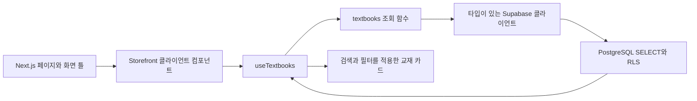

# AuraWorks Assignment — HIDDEN KICE

제공된 히든카이스 스토어 화면을 Next.js App Router로 구현한 과제입니다. 교재 정보는 Supabase PostgreSQL에 저장하고, 브라우저에서 조회해 표시합니다.

- 배포 사이트: [auraworks-assignment-seven.vercel.app](https://auraworks-assignment-seven.vercel.app)
- GitHub: [torisKR/auraworks_assignment](https://github.com/torisKR/auraworks_assignment) · Public
- Supabase: 과제 전용 `auraworks_assignment` 프로젝트

## 기술 스택

| 영역 | 기술 | 선택 이유 |
| --- | --- | --- |
| 프레임워크 | Next.js 16.3.4 · App Router | 페이지 구성, 이미지 최적화, Vercel 배포 |
| UI | React 19.2.4 · TypeScript 5.9.3 | 컴포넌트 재사용과 데이터·상태 계약의 명확성 |
| 스타일 | CSS · Pretendard | 제공 화면의 간격·색상·반응형 구현 |
| 데이터 | Supabase JS 2.110.1 · PostgreSQL | 브라우저 조회와 RLS 접근 제어 |
| 품질 관리 | ESLint · TypeScript · Node.js 테스트 | 정적 검사와 핵심 로직 검증 |
| 배포 | GitHub Actions · Vercel | main 변경 시 검사와 자동 배포 |

의존성 버전과 lockfile을 저장합니다. pnpm 11에서 설치 스크립트가 필요한 `unrs-resolver@1.12.2`는 `pnpm-workspace.yaml`에 해당 버전만 허용했습니다.

## 구현 범위

- 원본 배너·단품·패스 에셋을 활용한 헤더, 배너, 4열 교재 목록, 푸터
- 데스크톱 4열, 태블릿 3열, 모바일 2열 반응형 레이아웃
- 제목·과목 검색과 전체 / 패스 / 단품 필터
- Supabase에서 CSR로 교재 12개 조회
- 로딩 스켈레톤, 빈 목록, 검색 결과 없음, 조회 실패 및 재시도
- 교재 상세 모달과 세션 내 임시 장바구니 담기·삭제·합계
- 키보드 포커스, 검색 레이블, 필터 상태, `dialog`, reduced-motion 지원

AI OMR, 챌린지, 로그인, 약관 전문, 주문·결제는 안내만 제공하는 데모 범위입니다. 장바구니는 새로고침하면 초기화됩니다. 실제 판매 기능으로 오해하지 않도록 상세 안내를 표시합니다.

배너의 문구와 `1/5` 표시는 제공 이미지에 포함되어 있습니다. 현재 배너는 정적인 이미지이며 자동 슬라이드 기능은 없습니다. 모바일에서는 배너 비율에 맞춰 일부 이미지 영역이 잘립니다. 원본 에셋의 화면에 보이는 영역을 우선 구현했습니다.

## 실행

Node.js 22 이상과 pnpm 11.6.0을 사용합니다.

```bash
git clone https://github.com/torisKR/auraworks_assignment.git
cd auraworks_assignment
corepack enable
pnpm install --frozen-lockfile
cp .env.example .env.local
```

`.env.local`에 아래 두 값을 설정합니다. 키 값은 저장소에 올리지 않습니다.

```dotenv
NEXT_PUBLIC_SUPABASE_URL=https://your-project.supabase.co
NEXT_PUBLIC_SUPABASE_PUBLISHABLE_KEY=your-publishable-key
```

```bash
pnpm dev
# http://localhost:3000
```

설정이 없거나 조회에 실패하면 오류와 재시도 UI가 표시됩니다. 실제 Supabase 조회 대신 로컬 배열을 보여 주는 fallback은 없습니다.

## CSR 데이터 흐름



페이지와 화면 틀은 Next.js가 만들고, 교재는 브라우저의 `useEffect`에서 조회합니다. 조회 함수는 필요한 컬럼만 선택하고 `display_order`로 정렬합니다. 훅은 로딩·성공·실패 상태, 재시도와 언마운트 시 요청 취소를 담당합니다. 화면 컴포넌트는 SQL이나 클라이언트 초기화를 알 필요가 없습니다.

교재 12개를 한 번 조회한 뒤 검색·필터는 순수 함수로 처리합니다. 과제 규모에서는 불필요한 요청을 줄이고 즉시 결과를 표시할 수 있습니다. 데이터가 커지면 조회 계층에 서버 필터와 페이지네이션을 추가할 수 있습니다.

## 데이터베이스 재현

새 Supabase 프로젝트의 SQL Editor에서 순서대로 실행합니다.

1. `supabase/migrations/20261008023540_create_textbooks.sql`
2. `supabase/seed.sql`
3. `supabase/verify.sql`

검증 기대값은 교재 `12`, 단품 `3`, 패스 `9`, RLS `true`, 익명 SELECT `true`, INSERT/UPDATE/DELETE `false`입니다. seed는 같은 ID의 더미 교재를 갱신하므로 반복 실행할 수 있습니다. 스키마 migration은 새 프로젝트에서 한 번 적용합니다.

현재 과제용 원격 프로젝트에 스키마와 seed를 적용했습니다. SQL Editor에서 `anon` 역할로 12개 조회와 쓰기 권한 차단을 확인했습니다. 배포 페이지의 DevTools Network에서도 `/rest/v1/textbooks` 요청의 HTTP 200과 교재 12개 표시를 확인했습니다.

| 데이터 | 역할 |
| --- | --- |
| `id` | UUID 식별자 |
| `title`, `subject`, `description` | 교재 표시와 검색 |
| `category` | `single` / `pass` 필터 |
| `image_path` | 제공 이미지 경로 |
| `price`, `original_price`, `discount_percent` | 판매가, 정가, 배지 표시 |
| `display_order` | 화면의 안정적인 표시 순서 |

테이블에 RLS를 활성화하고 `anon`과 `authenticated`에 SELECT만 허용했습니다. 공개 키는 브라우저에 포함되지만 테이블 쓰기 권한은 없습니다. secret/service-role 키는 사용하지 않습니다. 새 사용자별 데이터나 주문 테이블을 추가하면 별도의 인증과 정책이 필요합니다.

제공 화면에는 정가 76,000원, 판매가 64,800원, 5% 배지가 함께 표시되어 있습니다. 화면 재현을 위해 이 값을 그대로 저장했습니다. 실제 할인율 계산을 적용하려면 할인 정책과 표시값을 먼저 일치시켜야 합니다.

## 구조

```text
src/
  app/                  # 라우팅, 메타데이터, 전역 스타일
  components/store/     # UI와 스토어 인터랙션
  hooks/use-textbooks.ts # 비동기 상태, 요청 취소, 재시도
  lib/
    supabase.ts         # typed browser client
    textbooks.ts        # SELECT 쿼리
    catalog.ts          # 순수 검색/필터/가격 함수
    catalog.test.ts     # 핵심 로직 테스트
  types/database.ts     # 교재·데이터베이스 계약
public/images/          # 원본 제공 이미지
supabase/               # migration, seed, 권한 검증 SQL
scripts/                # 원격 조회 검증
docs/                   # 설계·면접·배포 설명
```

자세한 설명은 [설계 문서](docs/architecture.md), [면접 준비](docs/interview.md), [배포 안내](docs/deployment.md)를 참고하세요.

향후 구현 순서와 완료 기준은 [기능 확장 계획](docs/future-extension.md), 기능별 폴더 전환과 파일 이동은 [폴더 구조 확장 설계](docs/folder-evolution.md)에 정리했습니다. 전체 문서는 [문서 안내](docs/README.md)에서 확인할 수 있습니다.

UI, 비동기 상태, 데이터 접근, 데이터 타입을 역할별로 분리했습니다. 과제 규모에 맞춰 별도 전역 상태 라이브러리 없이 검색·필터·모달·장바구니를 `Storefront`에서 관리합니다. 기능이 늘어나면 인증·주문 등 기능 단위로 폴더를 분리하고, 주문 가격 검증과 결제 처리는 서버로 옮기는 방향으로 확장할 수 있습니다.

## Vercel 배포

GitHub 저장소를 Vercel의 `auraworks-assignment` 프로젝트에 연결했습니다. 저장소 루트의 Next.js 앱을 빌드하고, `main` 커밋으로 Production 배포를 자동 생성합니다. 위 환경변수 두 개를 Preview와 Production에 설정합니다. `NEXT_PUBLIC_*` 값은 빌드에 포함되므로 변경하면 재배포가 필요합니다.

설정 단계와 검증 기준은 [배포 안내](docs/deployment.md)에 정리했습니다.

## 검증

```bash
pnpm check             # ESLint + TypeScript + unit tests
pnpm build             # Next.js production build
pnpm verify:supabase   # 실제 익명 REST 조회 및 seed 검증
```

GitHub Actions에서도 lint, typecheck, unit tests, build를 실행합니다. 빌드 통과는 Supabase 연결 성공이나 UI 검증을 대신하지 않습니다. 테스트는 공백·대소문자·한글 정규화, 카테고리와 검색의 교집합, 빈 결과, 입력 불변성, 원화 표시를 다룹니다.

2026-10-08 검증 결과:

| 검증 | 확인 결과 |
| --- | --- |
| 정적 검사와 테스트 | ESLint, TypeScript, 단위 테스트 6개 통과 |
| 원격 CI | [Quality checks 실행 #2](https://github.com/torisKR/auraworks_assignment/actions/runs/37721779107) Success |
| Vercel | `2095b1b` 커밋의 Production 배포 Ready |
| Supabase | 익명 조회 12개, RLS 활성화, INSERT/UPDATE/DELETE 권한 없음 |
| 브라우저 데이터 조회 | Supabase REST fetch HTTP 200, 교재 12개 표시 |
| 화면과 인터랙션 | 데스크톱 4열, 390px 모바일 2열, 단품 3개·패스 9개 필터, 검색 교집합과 빈 결과 |
| 모달과 장바구니 | 상세 표시, 담기, 합계, 삭제, Escape 닫기 확인 |

브라우저 검증은 Aside에서 진행했습니다. 개발자 도구에서 보인 확장 프로그램 경고는 사이트 코드와 분리해 확인했습니다. 첫 확인에서 발견한 favicon 404는 favicon 파일 추가로 수정했습니다. 해당 수정의 실제 배포 반영은 후속 커밋 배포에서 확인합니다. reduced-motion 스타일은 구현했으며 별도 런타임 에뮬레이션 검증은 하지 않았습니다.

## 기존 작업 폴더 동기화

새로 clone한 경우에는 일반적인 `git pull --ff-only origin main`을 사용하면 됩니다. 최초 로컬 폴더가 커밋 없이 미추적 소스 파일만 가지고 있어 pull이 막히는 경우에는 다음 스크립트를 사용할 수 있습니다.

```bash
bash scripts/sync-checkout.sh
```

스크립트는 원격 소스에 대응하는 로컬 파일을 `artifacts/`에 백업하고, 최초 커밋이 없는 경우에만 `git reset --mixed origin/main`으로 이력을 연결합니다. 작업 파일은 삭제하지 않습니다. 이어서 fast-forward pull, 소스 파일의 변경 사항 커밋, push를 수행합니다. `.env.local`, 의존성, 빌드 결과, 원본 작업용 `assets/`는 업로드하지 않습니다. 실제 페이지에서 사용하는 에셋은 `public/images/`에 포함되어 있습니다. 기존 staged 변경이나 예상하지 않은 원격 주소가 있으면 실행을 중단합니다.

## 커밋 규칙

Conventional Commits의 `type(scope): subject`를 사용하고 설정, 화면, DB, 테스트, 리팩터링, 문서를 독립 커밋으로 남깁니다. [`AGENTS.md`](AGENTS.md)에 개발 규칙을 기록했습니다.

## 참고 문서

- [Next.js App Router](https://nextjs.org/docs/app)
- [Supabase JavaScript SELECT](https://supabase.com/docs/reference/javascript/select)
- [Supabase RLS](https://supabase.com/docs/guides/database/postgres/row-level-security)
- [Vercel 환경변수](https://vercel.com/docs/environment-variables)
