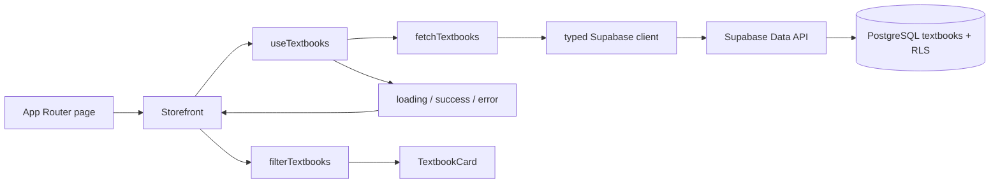

# 설계와 확장 방향

현재 구현의 설계를 설명하는 문서입니다. 향후 단계별 구현과 완료 기준은 [향후 기능 구현 계획](future-extension.md), 기존 파일 이동과 목표 폴더 구조는 [폴더 구조 확장 설계](folder-evolution.md)에 정리했습니다.

## 현재 데이터 흐름

서버는 페이지의 기본 구조와 초기 로딩 화면을 생성합니다. 교재 조회는 Client Component의 `useEffect`에서 시작하므로 초기 HTML에 DB의 교재 목록을 넣지 않습니다. 브라우저는 공개 키로 Supabase에 직접 SELECT를 요청합니다.

## 책임을 나눈 이유

| 계층               | 책임                                | 변경 예시                      |
| ------------------ | ----------------------------------- | ------------------------------ |
| `app`              | 경로, HTML 언어, 메타데이터         | 상세 페이지 경로 추가          |
| `components/store` | 표시, 사용자 입력, 스토어 상태 조합 | 카드 디자인이나 상세 모달 수정 |
| `hooks`            | 요청 생명주기와 상태                | 캐시 라이브러리 도입           |
| `lib/textbooks.ts` | 테이블, 필드, 정렬 등 조회 계약     | 서버 검색과 페이지네이션 도입  |
| `lib/catalog.ts`   | 순수 검색·가격 표시                 | 검색 규칙 변경과 단위 테스트   |
| `types`            | UI와 DB 사이의 타입 계약            | Supabase 타입 자동 생성        |
| `supabase`         | DB 구조와 접근 제어                 | 카테고리·출판사 테이블 분리    |

현재 데이터는 12개이므로 클라이언트에서 한 번 읽고 검색·필터를 수행합니다. `useMemo`, 전역 상태 라이브러리, 서버 API 프록시를 추가할 필요가 없는 규모입니다. 요구가 커지면 필요한 경계에서 교체할 수 있게 분리했습니다.

## 상태와 요청 취소

`CatalogState`는 discriminated union입니다. `success`에만 교재가 있고 `error`에만 오류 메시지가 있습니다. 서로 모순되는 `isLoading`, `error`, `data` 조합을 만들지 않습니다.

효과 정리 함수에서 `AbortController.abort()`를 호출합니다. 화면이 사라지거나 재시도가 이전 요청을 대체하면 해당 요청을 취소하고 완료 결과를 반영하지 않습니다. Strict Mode에서 첫 effect가 정리되는 경우에도 동일하게 동작합니다. 재시도는 요청 버전을 증가시켜 새로운 effect를 실행합니다.

## 보안 경계

공개 키는 브라우저 번들에 포함됩니다. 데이터를 보호하는 경계는 키를 숨기는 것이 아니라 PostgreSQL 권한과 RLS입니다. `anon`과 `authenticated`에는 `SELECT`만 부여하고 공개 교재 읽기 정책만 만듭니다. 공개 조회 대상에는 사용자 정보나 주문 정보가 없습니다.

교재의 가격, 카테고리, 이미지 경로, 표시 순서는 DB 제약조건으로 제한합니다. 관리자 쓰기는 브라우저에서 구현하지 않았습니다. secret/service-role 키는 클라이언트에 전달하지 않습니다.

## 확장할 때의 순서

1. **교재 수 증가:** `fetchTextbooks`에 필터·페이지 파라미터를 추가하고 Supabase `eq`, `ilike`, `range`로 서버에서 검색합니다. 요청 변경 시 취소하고 적절한 DB 인덱스를 추가합니다.
2. **다른 화면에서 같은 데이터 사용:** TanStack Query나 SWR를 조회 훅 뒤에 도입해 캐시·중복 요청·갱신을 관리합니다. 라이브러리 도입 전 실제 중복 요청 문제를 확인합니다.
3. **상세 페이지와 SEO:** `/textbooks/[id]`에 서버 조회와 메타데이터를 추가합니다. 과제의 목록 CSR 조건은 유지할 수 있습니다.
4. **회원과 장바구니:** `features/auth`, `features/cart`를 추가하고 로그인 사용자의 장바구니를 별도 테이블에 저장합니다. 사용자별 RLS로 소유권을 검증합니다.
5. **주문·결제:** 서버에서 DB 가격을 다시 읽어 금액을 계산하고 주문을 생성합니다. 클라이언트 합계를 신뢰하지 않습니다. 결제 webhook, 중복 처리 방지, 트랜잭션을 별도로 설계합니다.
6. **디자인 규모 증가:** 현재 CSS 변수에서 공통 색상·간격을 관리하고, 충돌이 나타나는 시점에 CSS Modules나 기능별 스타일 파일로 분리합니다.

## 의식적으로 남긴 제한

- 배너는 제공된 합성 이미지입니다. 이미지 안의 `1/5`는 artwork이며 다섯 개 슬라이드가 있다는 기능적 의미로 사용하지 않습니다. 추가 슬라이드 에셋을 받으면 실제 carousel로 교체할 수 있습니다.
- 정적인 배너 텍스트의 세밀한 반응형 재배치와 번역은 이미지로는 어렵습니다. 운영 화면에서는 배경/교재 이미지와 HTML 텍스트를 분리할 수 있습니다.
- 상품 제목·이미지·표시 가격은 주어진 화면을 따르고 과목·설명은 더미 데이터입니다.
- 장바구니는 메모리 상태이며 주문·결제 기능을 갖추지 않았습니다.
- 현재 DB 타입은 작은 스키마를 직접 명시했습니다. 스키마가 커지면 CLI의 프로젝트 타입 생성 결과를 사용하고 CI에서 차이를 검증합니다.
