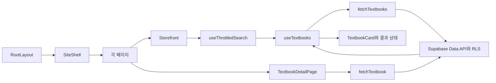

# 현재 설계와 확장 방향

실제 코드의 구조를 설명합니다. 페이지 체험은 [구현 안내](implemented-pages.md), 실제 인증·주문 등의 설계는 [향후 계획](future-extension.md), 추가 폴더 전환은 [구조 확장 설계](folder-evolution.md)를 참고하세요.

## 데이터와 화면 흐름

서버는 화면 틀과 메타데이터를 생성합니다. 목록과 상세의 교재 조회는 브라우저의 effect에서 시작하므로 초기 HTML에 DB 교재를 넣지 않습니다. 공개 키로 Supabase에 직접 SELECT를 요청하며 실패를 로컬 배열로 대체하지 않습니다.

## 현재 구조의 책임

| 영역                   | 책임                             | 변경 사례                           |
| ---------------------- | -------------------------------- | ----------------------------------- |
| `app`                  | 경로·메타데이터·페이지 조합      | 메뉴 경로와 상세 ID 전달            |
| `components/layout`    | 공통 헤더·푸터와 데모 상태       | 페이지 이동 시 로그인·장바구니 유지 |
| `components/store`     | 캐러셀·목록·카드·장바구니 표시   | 배너와 카드 디자인 수정             |
| `features`             | 상세·데모 로그인·OMR·챌린지 화면 | 기능별 상호작용 추가                |
| `data`                 | 배너·소개·상세 보조·챌린지 예시  | 더미 콘텐츠 변경                    |
| `hooks`                | 조회 상태·취소·재시도·스로틀     | 캐시나 페이지 조회 도입             |
| `lib/textbooks.ts`     | 컬럼·검색·정렬·단건 조회         | 페이지네이션 추가                   |
| `lib/catalog-query.ts` | 서버 검색 조건과 값 처리         | 검색 규칙 변경                      |
| `lib/throttle.ts`      | 주기 제한과 마지막 입력 보장     | 요청 간격 조정                      |
| `types`·`supabase`     | 데이터 계약·스키마·RLS           | 인증·주문 테이블 추가               |

최초 한 화면에서 여러 경로로 늘어나 공통 상태를 `Storefront`에서 `SiteShell`로 이동했습니다. Context는 공유할 데모 사용자와 장바구니만 제공하며 검색·OMR 답안·챌린지 체크 상태는 각 기능 가까이에 둡니다.

## 검색과 요청 상태

400ms 스로틀은 첫 입력을 즉시 전달하고 구간이 끝나면 최신 입력을 전달합니다. 검색어 지우기는 즉시 적용하고 예약된 작업을 취소합니다. 입력마다 타이머 종료를 400ms 뒤로 미루는 디바운스와 다릅니다.

Supabase 조회에 제목·과목 OR 부분 검색과 카테고리 조건을 전달합니다. 한글과 공백을 정규화하고 PostgREST 값의 따옴표와 LIKE 예약 문자를 처리합니다. `CatalogState`는 `loading`, `success`, `error` union이며 조회 결과는 조건·재시도 버전 키와 함께 저장합니다. 이전 조건의 데이터를 새 조건의 성공 결과로 표시하지 않습니다.

효과 정리에서 요청을 취소하고 취소된 결과는 반영하지 않습니다. 빈 결과는 성공 배열의 길이로 판단하고 실패에는 재시도를 제공합니다. 상세는 단건 조회와 존재하지 않는 교재 상태를 분리합니다.

## 실제 데이터와 데모의 구분

교재 제목·가격·이미지 등 기본 데이터는 Supabase에 있습니다. 상세 목차·후기는 `data/textbook-details.ts`의 예시입니다. 데모 로그인은 공용 입력 확인이며 Supabase Auth가 아닙니다. 로그인 입력은 저장하거나 전송하지 않습니다. OMR은 브라우저 답안 비교, 챌린지는 임시 참여 체험입니다.

실제 서비스 인증이나 가격 검증으로 사용할 수 없습니다. 로그인과 장바구니는 새로고침하면 사라지고, OMR·챌린지 상태는 해당 화면을 떠나면 초기화됩니다.

## 보안 경계

Supabase 공개 키는 브라우저에 포함됩니다. 현재 교재 테이블은 RLS를 활성화하고 `anon`·`authenticated`에 SELECT만 허용합니다. 사용자 정보와 주문은 이 테이블에 없습니다. 비밀 키를 클라이언트에 넣지 않습니다.

현재 교재 가격·종류·이미지 경로·표시 순서는 DB 제약으로 제한합니다. 데모 로그인을 실제 권한으로 사용하지 않습니다. 실제 회원 기능을 붙일 때는 요청별 세션 검증과 사용자별 정책을 별도로 추가해야 합니다.

## 검증 범위

ESLint, 타입 검사, 단위 테스트와 Next.js 프로덕션 빌드를 실행했습니다. 단위 테스트는 가격 표시, 검색 조건과 문자 처리, 스로틀의 첫·마지막 입력 및 예약 취소를 검증합니다. 브라우저 검색 HTTP 결과, 인터랙션과 배포는 별도 검증이 필요하며 코드 검사 통과만으로 완료했다고 설명하지 않습니다.

실제 인증·주문·결제·관리자·AI 분석·페이지네이션은 향후 범위입니다. 소개·약관·개인정보 페이지는 현재 데모 동작에 맞춘 예시 안내입니다.
