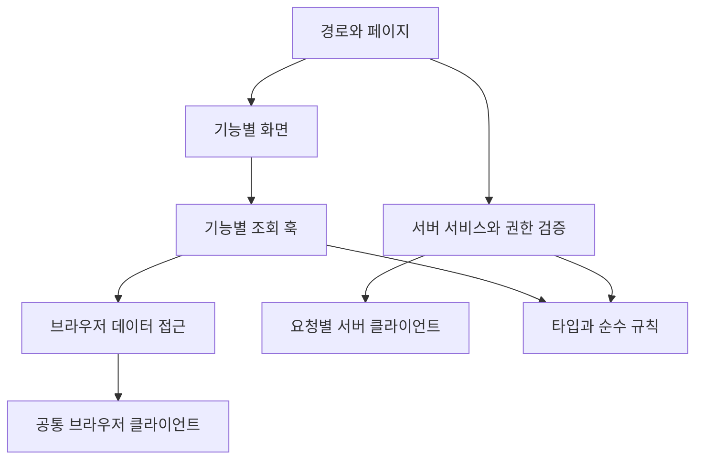

# 폴더 구조 확장 설계와 면접 설명

현재 구현은 역할별 구조이고, 여러 도메인이 생기면 기능별 구조로 단계적으로 전환할 계획입니다. 현재 상세·데모 인증·OMR·챌린지는 `features/`에 구현했습니다. 아래의 전체 목표 구조와 실제 인증·주문·결제 폴더는 향후 설계안입니다. 기능 구현 전에 빈 폴더나 사용하지 않는 추상화를 만들지 않습니다.

## 1. 현재 폴더 구조

```text
src/
  app/                         # 경로, 메타데이터, 전역 스타일
  components/store/            # 스토어 UI와 상호작용
  hooks/use-textbooks.ts        # 조회 상태, 취소, 재시도
  lib/
    supabase.ts                # 공개 조회용 브라우저 클라이언트
    textbooks.ts               # 교재 SELECT 계약
    catalog.ts                 # 검색·필터·가격 표시
    catalog.test.ts            # 순수 함수 검증
  types/database.ts            # 현재 교재와 DB 타입
public/images/                 # 실제 화면에서 쓰는 제공 이미지
supabase/
  migrations/                  # DB 구조와 접근 제어 변경
  seed.sql                     # 재현 가능한 더미 교재
  verify.sql                   # DB 권한 검증
docs/                          # 설계·확장·면접·배포 문서
```

최초 과제는 교재 스토어 한 화면이 중심이었습니다. 메뉴와 상세 경로가 추가되어 공통 헤더·푸터·로그인·장바구니 상태를 `components/layout/site-shell.tsx`로 옮겼습니다. 현재 추가된 구조와 동작은 [페이지 구현 문서](implemented-pages.md)에 정리했습니다. 이동 표는 앞으로 남은 구조 전환의 예시입니다.

## 2. 기능별 구조로 전환할 시점

다음과 같은 상황이 실제로 생길 때 전환합니다.

- 목록과 상세가 같은 교재 조회 계약을 공유합니다.
- 로그인과 회원 장바구니가 여러 경로에서 사용됩니다.
- `Storefront`에 인증·장바구니 동기화·주문 상태가 함께 모이기 시작합니다.
- 관리자·회원·공개 사용자의 데이터 접근 경계가 달라집니다.

파일 개수만 늘었다고 구조를 바꾸지는 않습니다. 서로 함께 바뀌는 코드를 기능 안에 모으고, 기능 사이에서 실제로 공유하는 기반만 공통 영역에 둡니다.

## 3. 향후 목표 구조

아래는 단계별 기능이 모두 추가된 뒤의 예시입니다. 각 폴더는 해당 기능을 구현할 때 만듭니다.

```text
src/
  app/
    page.tsx
    textbooks/[id]/page.tsx
    login/page.tsx
    cart/page.tsx
    orders/[id]/page.tsx
    admin/textbooks/page.tsx
    api/payments/webhook/route.ts
    layout.tsx
    globals.css

  features/
    textbooks/
      components/              # 목록, 카드, 툴바, 상세 UI
      hooks/                   # 목록 조회와 클라이언트 상태
      api/                     # 공개 목록의 브라우저 조회
      server/                  # 상세·주문 검증용 서버 조회
      model/                   # 검색 조건, 도메인 타입, 순수 규칙
    auth/
      components/              # 로그인 UI
      hooks/                   # 브라우저 세션 상태
      server/                  # 검증된 사용자 조회
    cart/
      components/              # 수량, 삭제, 장바구니 목록
      hooks/                   # 비회원·회원 장바구니 동기화
      api/                     # 본인 장바구니 조회·변경
      model/                   # 항목 타입과 합치기 규칙
    orders/
      components/              # 주문 내역과 상태 표시
      server/                  # 주문 생성, 금액·상태 검증
      model/                   # 주문 계약과 상태 전이
    payments/
      server/                  # 제공자 연동과 이벤트 검증
      model/                   # 이벤트·처리 결과 계약
    admin/
      components/              # 관리자 교재 폼과 목록
      server/                  # 관리자 권한 확인과 수정
    omr/                       # 요구 확정 후 업로드·분석 작업
    challenges/                # 참여·인증·보상 규칙

  components/
    layout/                    # 실제 여러 페이지에서 공유하는 헤더·푸터
    ui/                        # 공통 Dialog·버튼 등 재사용 UI
  lib/
    supabase/
      browser.ts               # 브라우저용 클라이언트
      server.ts                # 요청별 서버 인증 클라이언트
    env/                       # 공개·서버 환경변수 검증
  types/database.generated.ts  # 스키마에서 생성한 DB 타입

supabase/migrations/           # 기능별 스키마·RLS 변경
tests/e2e/                     # 여러 기능을 잇는 사용자 흐름
docs/                         # 결정 이유와 운영 절차
```

단위 테스트는 기능의 순수 규칙 파일 가까이에 둡니다. 여러 기능을 잇는 브라우저 검증만 `tests/e2e/`로 모읍니다. 모든 기능에 같은 하위 폴더를 강제로 만들 필요는 없습니다.

## 4. 폴더별 책임과 의존 방향

| 영역                | 해야 하는 일                                      | 넣지 않을 일                             |
| ------------------- | ------------------------------------------------- | ---------------------------------------- |
| `app`               | URL 입력 처리, 페이지 조합, 메타데이터, HTTP 경로 | 복잡한 주문 계산이나 재사용 DB 쿼리      |
| 기능의 `components` | 화면 표시와 사용자 입력                           | 비밀 키 접근, 결제 검증, SQL 계약        |
| 기능의 `hooks`      | 요청 생명주기·캐시·클라이언트 상태                | 관리자 권한의 최종 판단                  |
| 기능의 `api`        | 브라우저에서 허용된 데이터 접근                   | 서버 전용 자격 증명                      |
| 기능의 `server`     | 인증·권한·금액 검증과 서버 작업                   | React의 클라이언트 상태                  |
| 기능의 `model`      | 타입과 외부 의존 없는 업무 규칙                   | DB 연결과 브라우저 API                   |
| `lib`               | 여러 기능에 필요한 기반 연결                      | 모든 기능의 업무 로직을 한 파일에 모으기 |
| 생성된 DB 타입      | 실제 테이블·컬럼 계약                             | 화면 전용 상태와 폼 타입                 |



공통 `lib`나 UI가 상위의 특정 기능 화면을 가져오지 않게 합니다. 기능 간 의존이 필요하면 공개한 함수와 타입만 사용하고 서로 상대 기능 내부 파일을 가져오는 순환 구조를 피합니다.

예를 들어 주문 서비스는 교재의 서버 조회 계약을 통해 최신 가격을 확인할 수 있습니다. 교재 카드가 주문 서비스를 가져오거나 교재 조회가 주문 화면을 참조할 이유는 없습니다.

## 5. 브라우저와 서버 경계

- `"use client"`는 사용자 입력이나 클라이언트 상태가 필요한 경계에 둡니다.
- 서버 전용 모듈은 `.server.ts` 같은 이름과 서버 전용 import 보호를 함께 사용합니다. 이름만으로 접근이 차단되지는 않습니다.
- 비밀 환경변수는 서버 모듈에서만 읽고 `NEXT_PUBLIC_*`에는 넣지 않습니다.
- 현재 싱글턴은 공개 조회용 브라우저 클라이언트입니다. 인증된 서버 클라이언트는 요청별 사용자 세션을 기준으로 생성합니다.
- 클라이언트에서 전달한 사용자 ID·권한·가격은 최종 검증 근거로 사용하지 않습니다.
- 화면의 접근 제한과 서버 검증·DB 정책을 함께 적용합니다.

캐시를 도입하면 공개 교재 캐시와 사용자별 데이터를 구분합니다. 다른 사용자의 장바구니나 주문이 같은 캐시에 섞이지 않도록 키와 수명, 로그아웃 시 제거 정책을 설계합니다.

## 6. 기존 파일을 옮기는 방법

| 현재 파일                              | 향후 이동 후보                                      | 이동 시점                 |
| -------------------------------------- | --------------------------------------------------- | ------------------------- |
| `components/store/textbook-card.tsx`   | `features/textbooks/components/textbook-card.tsx`   | 상세 경로 추가            |
| `components/store/catalog-toolbar.tsx` | `features/textbooks/components/catalog-toolbar.tsx` | 목록 조건 확장            |
| `components/store/product-detail.tsx`  | `features/textbooks/components/product-detail.tsx`  | 상세 UI 재사용            |
| `hooks/use-textbooks.ts`               | `features/textbooks/hooks/use-textbooks.ts`         | 목록 조회 확장            |
| `lib/textbooks.ts`                     | `features/textbooks/api/fetch-textbooks.ts`         | 브라우저·서버 조회 분리   |
| `lib/catalog.ts`와 테스트              | `features/textbooks/model/`                         | 교재 기능 폴더 도입       |
| `features/cart/cart-content.tsx`       | `features/cart/components/cart-content.tsx`         | 회원 장바구니 도입        |
| `components/store/store-dialog.tsx`    | `components/ui/dialog.tsx`                          | 여러 기능에서 실제 재사용 |
| `types/database.ts`                    | 생성된 DB 타입과 기능별 타입                        | 스키마 확장               |

`Storefront`는 목록과 공통 화면을 조합하는 진입점으로 줄입니다. 현재의 검색·필터는 교재 기능에, 장바구니 상태는 장바구니 기능에 옮깁니다. 화면 자체에만 필요한 모달 열림 상태는 가까운 컴포넌트에 유지할 수 있습니다.

현재 DB 행과 `Textbook`이 같은 형태인 것은 작은 스키마에서 적절합니다. 조인, 사용자별 권한, 다른 화면의 데이터가 추가되면 DB 행 타입과 화면용 데이터 타입을 나눠 필요한 필드만 변환해서 전달합니다.

## 7. 단계별 리팩터링 절차

1. 현재 CSR 조회·필터·상세·장바구니 동작을 기준으로 남깁니다.
2. 교재 기능의 파일부터 이동하고 import 경로만 바꾸는 커밋을 만듭니다.
3. lint·타입 검사·기존 단위 테스트·빌드와 실제 목록 동작을 확인합니다.
4. 조회 조건과 페이지네이션 기능은 파일 이동과 별도 커밋으로 추가합니다.
5. 로그인·회원 장바구니를 추가할 때 세션, 스키마, RLS와 UI를 검증 가능한 단위로 나눕니다.
6. 주문·결제 등 새로운 도메인을 필요할 때 추가합니다.

구조 변경과 동작 변경을 나누면 문제가 발생했을 때 원인을 좁히기 쉽고 리뷰어도 변경 이유를 이해하기 쉽습니다. 전역 상태와 범용 저장소 인터페이스는 사용 범위나 실제 교체 필요가 확인된 뒤 도입합니다.

커밋 예시:

```text
refactor(textbooks): group catalog code by feature
feat(textbooks): add server filtering and pagination
feat(auth): add authenticated user sessions
feat(cart): persist user cart with owner policies
test(cart): verify cross-user access restrictions
feat(orders): create orders with validated prices
test(payments): cover duplicate event processing
```

## 8. 면접에서 구조를 설명하는 순서

### 30초 답변

“현재는 한 화면 과제라서 UI, 요청 상태, DB 접근, 타입을 역할별로 분리했습니다. 목록과 상세, 회원 장바구니처럼 도메인이 늘어나면 함께 바뀌는 파일을 `features/textbooks`, `features/cart` 등에 모으겠습니다. 경로는 화면을 조합하고, 기능 내부에서 조회와 규칙을 관리하며, 공통 영역에는 실제 공유하는 기반만 두는 방향입니다.”

### 코드로 보여 줄 근거

1. `app/page.tsx`에서 화면 조합의 진입점을 보여 줍니다.
2. `Storefront`가 쿼리를 직접 만들지 않고 `useTextbooks`를 사용하는 부분을 보여 줍니다.
3. 훅의 요청 취소·재시도와 `fetchTextbooks`의 컬럼·정렬 계약을 연결해서 설명합니다.
4. `catalog.ts`의 순수 함수와 테스트가 UI와 독립적인 것을 보여 줍니다.
5. migration의 공개 SELECT와 RLS 정책을 보여 줍니다.
6. 이 문서의 이동 표를 보면서 페이지네이션 또는 회원 장바구니를 추가할 변경 지점을 설명합니다.

### 예상 후속 질문

**“확장 가능하다는 근거가 폴더 이름뿐 아닌가요?”**

“폴더 이름만으로 보장되지는 않습니다. 컴포넌트가 DB 쿼리를 직접 만들지 않고 조회 함수와 훅을 통하는 것이 현재의 경계입니다. 서버 검색을 붙일 때 카드 표시 코드를 유지하고 조회 계약과 요청 상태를 바꿀 수 있다는 구체적인 변경 사례로 설명하겠습니다.”

**“처음부터 기능별 구조로 만들지 않은 이유는요?”**

“현재는 스토어 한 화면이 중심입니다. 아직 없는 회원·주문 기능까지 폴더와 추상화를 만들면 읽을 코드만 늘어납니다. 필요한 책임은 지금 분리하고, 여러 경로와 도메인이 생길 때 관련 파일을 기능별로 모으는 방식을 선택했습니다.”

**“공통 훅이나 공통 API 인터페이스를 만들면 더 좋지 않나요?”**

“실제 공통 요구가 생기면 도입하겠습니다. 현재 교재 조회 하나만으로 범용 계층을 만들면 기능 특성이 숨겨질 수 있습니다. 재사용할 규칙과 서로 다른 규칙이 무엇인지 확인한 다음 공통화하겠습니다.”

**“리팩터링하면서 기존 기능을 어떻게 지키나요?”**

“파일 이동과 기능 추가를 별도 커밋으로 분리하고 기존 테스트를 그대로 통과시키겠습니다. DB와 요청 구조가 바뀌는 단계에서는 단위 테스트에 더해 실제 역할별 권한과 브라우저 조회도 확인하겠습니다.”
