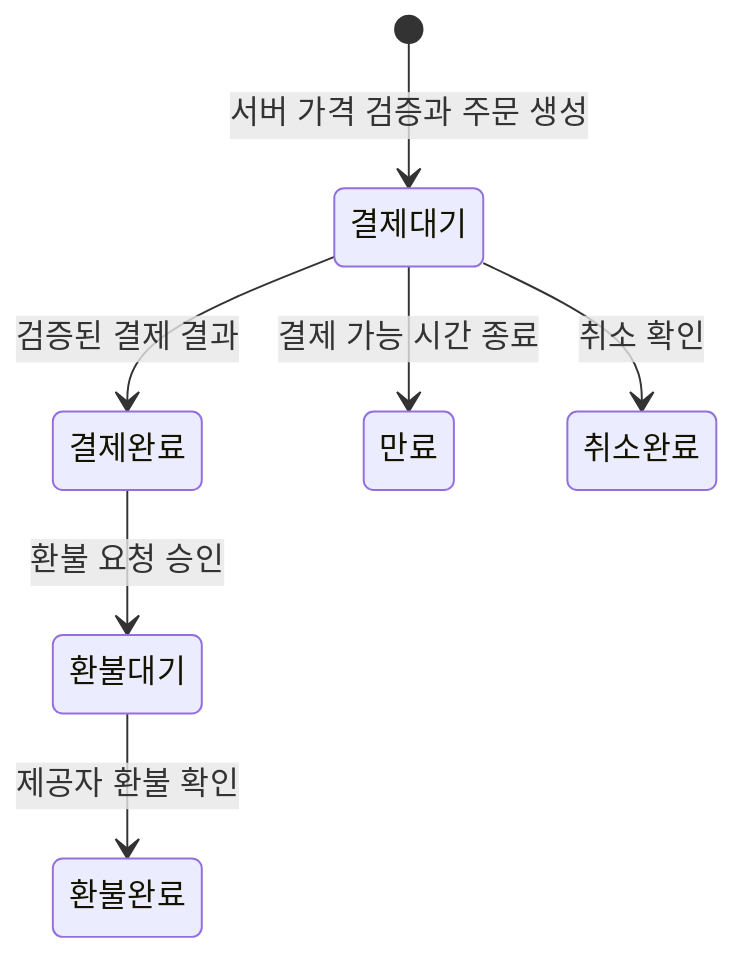

# 향후 기능 구현 계획

이 문서는 현재 과제를 서비스로 확장할 때의 구현 계획입니다. 실제 인증·회원 저장·주문·결제·관리자·AI 분석과 신규 테이블은 아직 구현하지 않았습니다. 캐러셀·메뉴 페이지·게스트 입장·상세·OMR 채점·챌린지 참여은 [현재 구현 안내](implemented-pages.md)에 정리했습니다. 구현한 범위와 앞으로 설계할 범위를 구분해서 면접에서 설명하는 것을 목표로 합니다.

현재 구조를 어떻게 옮길지는 [폴더 구조 확장 설계](folder-evolution.md), 현재 코드의 책임은 [설계 문서](architecture.md), 답변 예시는 [면접 준비](interview.md)를 참고하세요.

## 1. 현재 구현과 출발점

| 구분          | 현재 구현                                             | 확장 시 바뀌는 부분                       |
| ------------- | ----------------------------------------------------- | ----------------------------------------- |
| 교재 목록     | Supabase 교재 12개를 CSR로 조회                       | 서버 검색·정렬·페이지네이션               |
| 검색과 필터   | 400ms 스로틀을 거친 Supabase 서버 검색                | URL 상태와 페이지네이션 연동              |
| 상세          | ID로 CSR 조회하는 상세 경로와 표시용 목차·학습 가이드 | 실제 상세 데이터·공유 메타데이터          |
| 장바구니      | 로컬 저장 ID·수량·선택 + Supabase 교재 조회           | 회원별 소유권·기기 간 동기화              |
| 인증          | 게스트 프로필만 구현, 실제 회원 세션 미구현           | 로그인 세션과 서버 사용자 검증            |
| DB 권한       | 공개 교재 SELECT만 허용                               | 사용자별·관리자별 정책 추가               |
| 주문·결제     | 미구현                                                | 서버 가격 검증, 주문 상태, 결제 결과 검증 |
| AI OMR·챌린지 | 답안 채점·참여 체험                                   | 실제 AI 분석·회원 기록 저장               |

현재 코드의 경계는 `Storefront → useTextbooks → fetchTextbooks → Supabase`입니다. 새로운 기능을 추가할 때 기존 카드 안에 인증, DB 쓰기, 결제 처리를 한꺼번에 넣지 않고 해당 책임을 분리합니다.

## 2. 우선순위와 의존 관계

| 단계 | 구현할 기능                   | 먼저 필요한 것                  | 완료 기준                                    |
| ---- | ----------------------------- | ------------------------------- | -------------------------------------------- |
| 1    | 목록 페이지네이션·상세 페이지 | 조회 조건과 상세 데이터 계약    | 직접 상세 진입, 뒤로 가기, 목록 조건 복원    |
| 2    | 로그인·회원 장바구니          | 세션 검증과 사용자별 RLS        | 새로고침 유지, 다른 회원 데이터 접근 차단    |
| 3    | 주문·결제                     | 회원, 서버 가격 검증, 주문 모델 | 중복 요청 방지, 검증된 결제 결과로 상태 변경 |
| 4    | 관리자 교재 관리              | 관리자 권한과 입력 검증         | 일반 회원 수정 차단, 변경 이력 기록          |
| 5    | 배너 운영·AI OMR·챌린지       | 운영 요구와 각 기능 데이터 계약 | 기능별 실패·재시도·접근 권한 검증            |

관리자 기능은 목록 확장과 병행할 수도 있습니다. 다만 권한 모델과 검증이 준비된 뒤에 공개합니다. 날짜나 개발 기간을 고정하기보다 각 단계의 요구사항과 완료 기준을 먼저 합의합니다.

## 3. 교재 목록과 검색 확장

### 구현 방향

- 조회 함수에 검색어, 종류, 정렬, 페이지 크기와 페이지 정보를 전달합니다.
- 목록의 교재 조회는 과제 요구대로 CSR을 유지하고 검색 조건에 맞는 데이터만 가져옵니다.
- `?category=pass&query=수학&page=2`처럼 URL에 목록 조건을 저장합니다.
- 검색 조건이 바뀌면 첫 페이지로 이동하고 이전 요청 결과가 새 결과를 덮어쓰지 않도록 합니다.
- 검색 입력에 짧은 지연을 적용해 입력마다 네트워크 요청이 발생하지 않게 합니다.
- 처음에는 페이지 번호 방식으로 시작하고, 데이터 규모와 변경 빈도에 따라 커서 방식을 검토합니다.

현재 `fetchTextbooks`는 검색·종류 조건을 지원하고 배열만 반환합니다. 페이지네이션을 구현할 때는 `items`, 전체 개수 또는 다음 페이지 존재 여부를 포함하는 반환 계약으로 변경합니다. `useTextbooks`가 요청 상태를 담당하고 카드는 전달받은 교재만 표시합니다.

인덱스는 예상만으로 계속 추가하지 않습니다. 실제 검색 방식과 조회 계획을 확인해 카테고리·정렬·검색에 맞는 인덱스를 선택합니다. 제목과 과목을 함께 검색할 때는 기존 한글 정규화·공백 처리 의도를 유지하고 사용자 검색어를 쿼리 구문으로 직접 이어 붙이지 않습니다.

캐시가 필요한 여러 화면이 생기면 조회 훅 내부에 캐시 도구를 도입합니다. 조회 키에는 검색어·카테고리·정렬·페이지를 포함하며, 관리자 수정 후에는 해당 목록과 상세 데이터를 갱신합니다.

### 완료 기준

- 검색과 필터를 함께 적용한 결과 및 페이지 개수가 맞습니다.
- 새로고침과 뒤로 가기 후 목록 조건이 복원됩니다.
- 빠르게 검색어를 바꿔도 이전 결과가 최종 결과로 표시되지 않습니다.
- 마지막 페이지, 빈 결과, 네트워크 실패와 재시도가 동작합니다.

### 면접 설명

“현재는 입력 스로틀을 거쳐 Supabase에서 검색합니다. 데이터가 늘면 조회 함수와 훅에 서버 검색과 페이지 정보를 추가하겠습니다. 카드의 표시 책임은 유지하면서 전송량과 목록 상태 관리 방식을 바꾸는 설계입니다.”

## 4. 교재 상세 페이지

`/textbooks/[id]`를 추가해 링크 공유와 직접 진입을 지원합니다. 기존 모달은 빠른 미리보기로 유지할 수 있습니다.

- 서버에서 공개 교재를 조회해 제목·설명·공유 메타데이터를 생성합니다.
- 없는 ID, 비공개 교재, 조회 실패를 구분합니다.
- 이미지, 수록 내용, 출판 정보 등 실제 상세 요구가 정해지면 스키마를 확장합니다.
- 장바구니 담기 같은 상호작용만 클라이언트 컴포넌트로 분리합니다.

목록 CSR과 상세 서버 조회는 역할이 다르므로 함께 사용할 수 있습니다. 수정 즉시 반영이 필요한 데이터와 캐시해도 되는 정보를 구분해 캐시 정책을 결정합니다.

완료 기준은 직접 URL 진입, 잘못된 ID의 오류 처리, 공유 메타데이터, 상세에서 장바구니 담기입니다.

## 5. 로그인과 회원 장바구니

### 인증부터 바꿔야 하는 이유

현재 공개 조회용 Supabase 클라이언트는 인증 세션 저장과 자동 갱신을 꺼 둔 상태입니다. 로그인 화면만 추가해서는 회원 기능이 완성되지 않습니다. 브라우저 세션 처리, 요청별 서버 인증 클라이언트, 로그아웃·세션 만료 처리까지 함께 설계해야 합니다.

서버는 브라우저가 보낸 `user_id`를 믿지 않고 검증된 사용자 정보에서 소유자를 결정합니다. 화면에서 버튼을 숨기는 것과 DB에서 접근을 차단하는 것을 함께 적용합니다.

### 제안 데이터 모델

아래 테이블은 신규 migration으로 추가할 계획입니다.

| 테이블       | 주요 필드                           | 제약과 권한                                           |
| ------------ | ----------------------------------- | ----------------------------------------------------- |
| `profiles`   | 사용자 ID, 표시 이름                | 본인 정보만 읽기·수정, 관리자 권한 필드와 분리        |
| `cart_items` | 사용자 ID, 교재 ID, 수량, 수정 시각 | 사용자·교재 조합 중복 금지, 양수 수량, 본인 행만 접근 |

비회원 장바구니는 현재 교재 ID·수량·선택 여부를 로컬 저장소에 보관하도록 구현했습니다. 회원 장바구니에는 전체 `Textbook` 객체와 과거 가격을 저장하지 않습니다. 최신 교재 정보는 다시 조회하고 결제 금액은 서버에서 확정합니다.

로그인 시 비회원 장바구니와 회원 장바구니를 합치는 규칙을 정합니다. 동일 교재 수량 합산, 최대 수량, 판매 중단 교재 처리 등을 명시하고 중복 동기화에도 같은 결과가 나오도록 합니다.

### 완료 기준

- 로그인한 회원의 장바구니가 새로고침 후 유지됩니다.
- 회원 A가 회원 B의 행을 조회·수정·삭제하려는 요청이 DB에서 차단됩니다.
- 로그아웃하면 이전 회원의 장바구니와 캐시가 화면에서 제거됩니다.
- 세션 만료 시 로그인 안내가 표시되고 무한 재시도가 발생하지 않습니다.
- 동일 교재 담기는 정의한 수량 규칙대로 동작합니다.

### 면접 설명

“현재 비회원 장바구니는 ID·수량·선택 상태를 로컬에 저장하고 최신 교재를 조회합니다. 회원 기능에서는 교재 ID와 수량을 저장하고 사용자별 RLS를 적용하겠습니다. 장바구니에 저장된 가격은 주문의 기준으로 사용하지 않겠습니다.”

## 6. 주문과 결제

이 단계는 실제 결제 제공자, 취소·환불 정책, 판매 조건을 정한 뒤 구현합니다. 현재 프로젝트에는 주문이나 결제 API가 없습니다.

### 서버에서 처리할 흐름

1. 요청자의 로그인 상태와 교재 ID·수량·중복 요청 식별자를 검증합니다.
2. DB에서 현재 판매 가능 여부와 가격을 읽어 주문 금액을 계산합니다.
3. 주문과 주문 항목을 하나의 DB 트랜잭션으로 저장합니다.
4. 결제 제공자에 필요한 결제 정보를 서버에서 생성합니다.
5. 서명 등 제공자의 검증 절차를 통과한 결제 이벤트와 주문 금액·상태를 대조합니다.
6. 결제 기록과 주문 상태를 원자적으로 변경하고 중복 이벤트에는 기존 처리 결과를 반환합니다.

서버에서 Supabase 호출을 여러 번 순서대로 실행하는 것만으로는 트랜잭션이 되지 않습니다. 원자성이 필요한 변경은 검증과 변경을 포함한 DB 함수/RPC 또는 트랜잭션을 지원하는 서버 DB 접근으로 구현합니다.

### 제안 데이터 모델

| 테이블           | 저장할 정보                                | 중요한 이유                               |
| ---------------- | ------------------------------------------ | ----------------------------------------- |
| `orders`         | 소유자, 상태, 통화, 총액, 중복 요청 식별자 | 사용자의 주문 조회와 재전송 제어          |
| `order_items`    | 교재 ID, 구매 당시 제목·단가·수량          | 교재 가격 변경 후에도 주문 당시 정보 보존 |
| `payments`       | 제공자 결제 ID, 주문 ID, 검증된 결제 상태  | 결제 결과 대조와 중복 반영 방지           |
| `payment_events` | 제공자 이벤트 ID, 처리 상태·시각           | 중복 이벤트와 실패 재처리 관리            |

주문 생성 식별자와 제공자 이벤트 ID에는 중복 방지 제약을 둡니다. 이벤트 수신 기록만 저장하고 주문 갱신에 실패해도 재처리가 가능해야 하므로 이벤트 처리 상태와 주문 변경의 원자성을 함께 설계합니다.

### 상태 전이와 실패 처리

이 상태도는 초안입니다. 실패·재시도·부분 환불·배송 상태는 실제 판매 정책에 맞춰 별도로 정합니다. 결제 성공 페이지 진입만으로 결제 완료를 확정하지 않습니다. 응답을 받지 못한 경우 결제 제공자의 실제 처리 결과를 확인하고, 순서가 바뀐 이벤트도 허용된 상태 전이 안에서 처리합니다.

### 완료 기준

- 클라이언트가 가격이나 소유자 정보를 바꿔 보내도 서버 계산·인증 결과가 적용됩니다.
- 동일 주문 생성 요청을 재전송해도 주문이 중복 생성되지 않습니다.
- 동일 결제 이벤트가 여러 번 도착해도 한 번만 반영됩니다.
- 잘못된 이벤트, 금액 불일치, 상태 역전이 차단됩니다.
- 결제 결과 반영 도중 실패한 이벤트를 재처리할 수 있습니다.
- 결제 제공자의 테스트 환경에서 성공·실패·취소·환불을 검증합니다.

## 7. 관리자 교재 관리

관리자 화면에 등록·수정·판매 중지·정렬·이미지 관리 기능을 추가합니다. 기존 공개 읽기 정책과 관리자 쓰기 정책을 별도로 설계합니다.

- 관리자 권한은 일반 회원이 수정할 수 있는 프로필 필드에 두지 않습니다.
- 서버 요청과 DB 정책에서 관리자 권한을 검증합니다.
- 가격, 할인 표시, 판매 상태, 이미지 경로를 서버에서도 검증합니다.
- 현재 두 이미지 경로만 허용하는 DB 제약은 업로드 구조 도입 시 migration으로 바꿉니다.
- 주문에서 참조한 교재는 삭제보다 판매 중지 처리를 우선 검토합니다.
- 변경 전후 값, 수정자, 수정 시각을 감사 이력에 남깁니다.

공개·비공개 상태를 도입하면 현재 모든 교재를 읽게 하는 공개 SELECT 정책도 함께 변경합니다. 화면에서 비공개 항목을 숨기는 것으로 끝내지 않고 DB의 공개 읽기 조건에 공개 상태를 반영합니다. 판매 중지와 비공개는 서로 다른 요구이므로 상태의 의미를 먼저 정의합니다.

현재 화면의 정가·판매가·5% 배지는 계산상 일치하지 않습니다. 운영 전에는 실제 할인율과 캠페인 표시 중 어떤 의미인지 확정하고 데이터·표시 규칙을 통일합니다.

완료 기준은 일반 회원의 직접 쓰기 요청 차단, 관리자 수정 성공, 잘못된 가격 거부, 변경 이력 확인, 목록 갱신입니다.

## 8. 배너·AI OMR·챌린지

### 운영 가능한 배너

현재 합성 이미지의 텍스트·버튼·페이지 숫자를 HTML과 개별 이미지로 분리합니다. 배너 내용, 링크, 노출 순서, 노출 기간을 데이터로 관리합니다. 자동 재생을 추가한다면 일시정지, 키보드 이동, 움직임 감소 설정을 함께 처리합니다.

### AI OMR

요구사항을 먼저 정합니다. 입력이 답안 이미지인지 수동 입력인지, 채점만 하는지 분석까지 제공하는지에 따라 모델과 비용이 달라집니다.

업로드 파일 크기·형식 검증, 비공개 저장소, 소유자별 접근, 파일 보관·삭제 기준을 설계합니다. 오래 걸리는 분석은 요청 중 계속 기다리는 방식 대신 작업 ID와 대기·처리 중·완료·실패 상태로 관리합니다. 제공자 비밀 키와 과금 호출은 서버에서 처리하고 재시도와 이용 한도를 둡니다.

완료 기준은 다른 사용자 파일 접근 차단, 잘못된 파일 거부, 작업 실패·재시도, 새로고침 후 결과 조회입니다.

### 학습 챌린지

챌린지 정의, 참여, 학습 인증 기록을 분리합니다. 사용자·챌린지·인증 날짜 등의 중복 기준과 시간대를 명시하고, 화면 표시와 서버 검증에서 동일한 기간 규칙을 적용합니다. 점수·보상을 제공할 때는 클라이언트가 보낸 점수를 그대로 인정하지 않습니다.

완료 기준은 중복 참여·인증 방지, 기간 경계 처리, 본인 기록 접근, 재시도 시 보상 중복 방지입니다.

## 9. 기능별 검증과 운영 준비

| 검증 수준        | 추가할 검증                                                      |
| ---------------- | ---------------------------------------------------------------- |
| 순수 함수 테스트 | 수량 규칙, 목록 조건, 금액 계산, 허용된 주문 상태 전이           |
| DB 통합 검증     | 회원 A/B·관리자·익명 역할 권한, 중복 제약, 트랜잭션 실패 시 롤백 |
| 브라우저 검증    | 로그인·장바구니 유지, 뒤로 가기, 오류·빈 결과, 키보드 모달 이동  |
| 외부 연동 검증   | 결제 테스트 환경과 webhook 재전송, OMR 작업 실패·재시도          |
| 배포 검증        | 환경변수, migration 적용, 실제 URL, 모바일·접근성·요청 결과      |

로그에는 주문·작업을 추적할 식별자와 실패 원인을 남기되 비밀 키와 불필요한 개인정보는 기록하지 않습니다. 외부 서비스 지연과 DB 오류를 구분해 확인할 수 있도록 합니다.

DB 변경은 버전 관리된 migration으로 남깁니다. 새 필드를 먼저 추가하고 앱을 전환한 뒤 이전 필드를 정리하는 순서로 배포합니다. 데이터 변경은 앱 코드만 되돌리는 것으로 복구되지 않으므로 백업과 복구 절차도 별도로 준비합니다.

## 10. 면접에서 지켜야 할 설명 범위

- “구현했다”: 현재 코드와 실제 검증 결과로 설명합니다.
- “설계했다”: 이 문서의 선택 이유, 데이터 계약, 실패 처리와 완료 기준을 설명합니다.
- “추후 검토한다”: 캐시 도구, 검색 방식, 결제 제공자 등 요구와 측정 결과가 필요한 선택임을 밝힙니다.

“결제와 관리자 기능을 이미 구현했다”가 아니라 “현재는 목록과 비회원 영속 장바구니까지 구현했고, 주문을 붙일 때는 서버 가격 검증·원자적 저장·중복 이벤트 처리부터 추가하도록 확장 계획을 정리했다”고 설명합니다.
